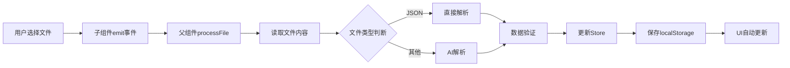

# Upload组件

## 架构设计

### 核心设计原则

1. **单向数据流**: 用户操作 → 父组件处理 → Store更新 → 子组件响应
2. **单一数据源**: Store是唯一的状态来源，子组件完全无状态
3. **统一处理**: 所有业务逻辑集中在父组件的`processFile`函数
4. **双Store架构**: 上传状态与业务数据分离管理

## 组件结构

```
src/components/upload/
├── Uploading.vue              # 主容器组件 (核心业务逻辑)
├── BaseUpload.vue             # 基础上传组件 (通用UI)
├── PaperUpload.vue            # 试卷上传组件 (事件转发)
├── AnswerUpload.vue           # 参考答案上传组件 (事件转发)
├── StudentUpload.vue          # 学生答案上传组件 (事件转发)
└── Preview.vue                # 预览弹窗组件 (内容展示)
```

## 状态管理

### useUploadStatusStore (上传状态管理)

**职责**: 管理文件上传的状态、进度、错误信息

```typescript
interface UploadItem {
  name: string                 // 文件名
  status: 'idle' | 'uploading' | 'processing' | 'ready' | 'error'
  rawContent: string          // 原始文件内容 (用于预览)
  parsedData?: any           // 解析后的JSON数据
  error?: string             // 错误信息
  meta?: any                 // 元数据 (题目数量等)
}

// Store状态
const examPaper: Ref<UploadItem>
const referenceAnswer: Ref<UploadItem>
const studentAnswers: Ref<UploadItem>

// 计算属性
const canUploadAnswer: boolean     // 是否可以上传参考答案
const canUploadStudent: boolean    // 是否可以上传学生答案
const canProceedToGrading: boolean // 是否可以进入评分页面
```

**关键方法**:

- `setPaperUploading(name, content)` - 设置试卷上传中状态
- `setPaperReady(data, meta)` - 设置试卷就绪状态
- `setPaperError(error)` - 设置试卷错误状态
- `resetPaper()` - 重置试卷状态
- `resetAll()` - 重置所有状态

### useExamDataStore (核心数据管理)

**职责**: 管理解析后的核心业务数据

```typescript
// 核心数据
const questions: Ref<Question[]>                    // 试卷题目
const referenceAnswers: Ref<ReferenceAnswer[]>      // 参考答案
const studentAnswers: Ref<StudentAnswer[]>          // 学生答案
const studentList: Ref<StudentInfo[]>               // 学生列表
const highlightDataList: Ref<HighlightData[]>       // AI评分结果
```

**关键方法**:

- `setQuestions(questions)` - 设置试卷题目
- `setReferenceAnswers(answers)` - 设置参考答案
- `setStudentAnswers(answers)` - 设置学生答案
- `getQuestionById(id)` - 根据ID获取题目
- `getReferenceAnswer(questionId)` - 获取指定题目的参考答案
- `getStudentAnswer(studentId, questionId)` - 获取指定学生的答案

## 数据流详解

### 1. 文件上传流程



### 2. 核心处理函数

```typescript
const processFile = async (file: File, type: 'paper' | 'answer' | 'student') => {
  try {
    // 1. 读取文件内容
    const content = await readFileContent(file)
    
    // 2. 设置上传状态
    uploadStore.setXxxUploading(file.name, content)
    
    // 3. 解析数据
    let parsedData
    if (isJsonFile(file.name)) {
      parsedData = JSON.parse(content)
    } else {
      parsedData = await uploadLLMService.Parse(content, type)
    }
    
    // 4. 验证数据
    validateJsonData(parsedData, type)
    
    // 5. 更新Store
    examStore.setXxx(parsedData.xxx)
    uploadStore.setXxxReady(parsedData, meta)
    
    // 6. 保存到本地
    examStore.saveToLocal()
    uploadStore.saveToLocal()
    
  } catch (error) {
    uploadStore.setXxxError(error.message)
  }
}
```

### 3. UI响应机制

```typescript
// 计算属性驱动UI更新
const paperDisplayText = computed(() => {
  const paper = uploadStore.examPaper
  if (paper.status === 'error') return paper.error
  if (paper.status === 'ready') return `当前试卷：${paper.name}（共${paper.meta?.questionCount}道题目）`
  return ''
})

// 子组件通过props接收状态
<PaperUpload
  :status="uploadStore.examPaper.status"
  :file-name="uploadStore.examPaper.name"
  :display-text="paperDisplayText"
  :error="uploadStore.examPaper.error"
/>
```


### Uploading.vue (主容器组件)

**职责**: 统一的业务逻辑处理中心

**核心功能**:

- 文件处理 (`processFile`)
- 事件处理 (`handleXxxSelected`, `handleXxxRemove`)
- 预览管理 (`handleXxxPreview`)
- 重置操作 (`resetAll`)

**关键代码结构**:

```vue
<template>
  <!-- 三个子组件 + 重置按钮 + 预览弹窗 -->
</template>

<script setup lang="ts">
// Store
const uploadStore = useUploadStatusStore()
const examStore = useExamDataStore()

// 计算属性
const paperDisplayText = computed(...)
const answerDisplayText = computed(...)
const studentDisplayText = computed(...)

// 核心处理函数
const processFile = async (file, type) => { ... }

// 事件处理
const handlePaperSelected = (file) => processFile(file, 'paper')
const handlePaperRemove = () => { ... }
const handlePaperPreview = () => { ... }
</script>
```

### BaseUpload.vue (基础上传组件)

**职责**: 通用的上传UI组件，完全无状态

**核心功能**:

- 文件拖拽上传界面
- 状态显示 (idle/uploading/ready/error)
- 操作按钮 (预览/移除)
- 响应式布局

**Props接口**:

```typescript
interface Props {
  title: string           // 卡片标题
  uploadTitle: string     // 上传区域标题
  icon: Component         // 显示图标
  cardClass: string       // 卡片样式类
  uploadClass: string     // 上传区域样式类
  accept: string          // 接受的文件类型
  uploadHint: string      // 上传提示文本
  disabled: boolean       // 是否禁用
  status: string          // 当前状态
  fileName: string        // 文件名
  displayText: string     // 显示文本
  error: string           // 错误信息
}
```

**关键特性**:

- **状态驱动UI**: 根据status自动显示对应的状态标签和图标
- **文件列表管理**: 监听状态变化自动清空文件列表
- **响应式设计**: 支持移动端适配

### 子组件 (PaperUpload, AnswerUpload, StudentUpload)

**职责**: 纯事件转发，无业务逻辑

**代码结构**:

```vue
<template>
  <BaseUpload
    title="Paper Management"
    :status="status"
    :file-name="fileName"
    :display-text="displayText"
    :error="error"
    :disabled="disabled"
    @file-selected="$emit('file-selected', $event)"
    @remove="$emit('remove')"
    @preview="$emit('preview')"
  />
</template>

<script setup>
// 只接收props和转发事件，无任何业务逻辑
defineProps([...])
defineEmits(['file-selected', 'remove', 'preview'])
</script>
```

### Preview.vue (预览组件)

**职责**: 统一的文件内容预览

**核心功能**:

- 显示原始文件内容
- 支持复制到剪贴板
- 响应式弹窗布局

## 开发指南

### 添加新的文件类型

1. **扩展UploadItem类型**:

```typescript
// 在useUploadStatusStore中添加新状态
const newFileType: Ref<UploadItem> = ref({...})
```

1. **添加处理方法**:

```typescript
const setNewFileUploading = (name: string, content: string) => {...}
const setNewFileReady = (data: any, meta: any) => {...}
const setNewFileError = (error: string) => {...}
```

1. **创建子组件**:

```vue
<!-- NewFileUpload.vue -->
<template>
  <BaseUpload
    title="New File Type"
    :status="status"
    @file-selected="$emit('file-selected', $event)"
  />
</template>
```

1. **在父组件中集成**:

```vue
<!-- Uploading.vue -->
<NewFileUpload
  :status="uploadStore.newFileType.status"
  @file-selected="handleNewFileSelected"
/>
```

### 修改文件处理逻辑

所有文件处理逻辑都在`Uploading.vue`的`processFile`函数中：

```typescript
const processFile = async (file: File, type: 'paper' | 'answer' | 'student' | 'newType') => {
  // 在这里添加新的处理逻辑
  if (type === 'newType') {
    // 新类型的特殊处理
  }
}
```

### 添加新的验证规则

在`fileReaders.ts`中的`validateJsonData`函数添加：

```typescript
export function validateJsonData(jsonData: any, type: 'paper' | 'answer' | 'student' | 'newType') {
  switch (type) {
    case 'newType':
      // 新类型的验证逻辑
      if (!jsonData.requiredField) {
        throw new Error('缺少必要字段')
      }
      break
  }
}
```

## 调试技巧

### 1. 状态追踪

```javascript
// 在浏览器控制台查看Store状态
console.log('Upload状态:', uploadStore.$state)
console.log('Exam数据:', examStore.$state)
```

### 2. 数据流追踪

在`processFile`函数中添加日志：

```typescript
console.log(`📁 开始处理${type}文件:`, file.name)
console.log(`📄 文件内容:`, content.substring(0, 100))
console.log(`✅ 解析结果:`, parsedData)
```

### 3. localStorage检查

```javascript
// 查看本地存储
Object.keys(localStorage).filter(key => key.startsWith('exam_') || key.startsWith('upload_'))
```

## 注意事项

### 1. 文件格式要求

- **试卷**: 支持TXT, DOC, DOCX, JSON
- **参考答案**: 支持TXT, DOC, DOCX, JSON
- **学生答案**: 仅支持JSON格式

### 2. 数据依赖关系

- 参考答案上传需要先上传试卷
- 学生答案上传需要先上传试卷
- 参考答案是可选的

### 3. 错误处理

- 所有错误都会保存到Store中
- 错误状态下仍可预览原始文件内容
- AI解析失败会提示用户上传JSON格式

### 4. 性能考虑

- 大文件会在读取时可能造成界面卡顿
- AI解析可能需要较长时间
- localStorage有大小限制 (~5MB)